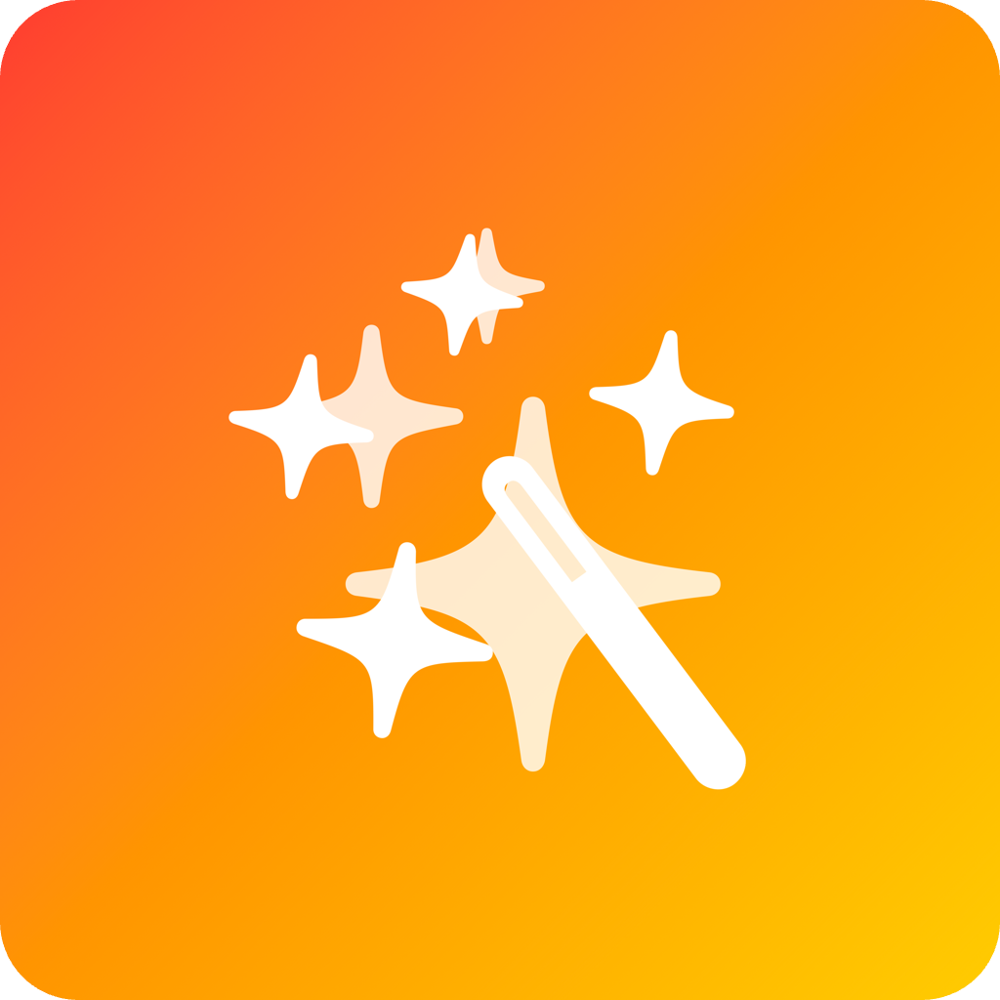
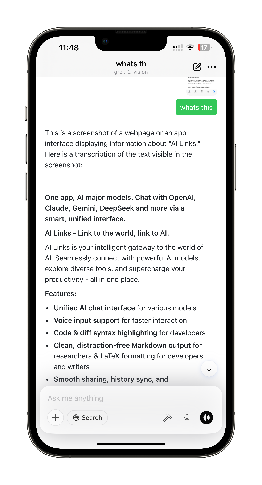

  

<h1 align="center">AiLinks — 思いのままに話し、どんなAIともこれまで以上に速くつながる</h1>

  
  
  
  

  <a href="README.md">English</a> | <a href="README.ZH.md">中文</a> | <b>日本語</b>

**iPhone・iPadで、AIと会話するための最もスムーズな音声ファーストワークスペース。**

AiLinksは長いプロンプトも素早く音声メモに変換：**タップ → 話す → 完了**。  
GPT-4o、Claude 3 Sonnet、Gemini 2.5 Pro、DeepSeek V2など、世界最先端のAIモデルをアプリ内でワンタップ切り替え。

  

## ✨ 主な機能

| | |
| --- | --- |
| 🔊 **ワンタップ音声入力** | マイクを押して話し、離すだけ——タイピングより30%速い |
| ⚡ **マルチモデル対応** | GPT-4o、Gemini、Claude、DeepSeekなどをワンタップで切替 |
| 🗂 **スペース管理** | サイドバー型ワークスペースで仕事・勉強・生活の会話を整理 |
| 📲 **オンデバイスWhisper** | 短い音声は端末内で文字起こし、長い音声はクラウドで省電力変換 |
| ☁️ **iCloud同期** | 会話やスペースがiPhone・iPad間でリアルタイム同期 |
| 🌐 **アーティファクトプレビュー** | チャット内でHTML・Markdown・コードブロックを即時表示 |
| 🗒 **Markdownエクスポート** | ワンタップでファイル・iCloud Drive・Obsidianへ共有 |
| ⭐ **純正SwiftUI** | 100% SwiftUI、VisionOS対応、アプリサイズたった5MB、Electron不要 |

## 🗺 今後のロードマップ

- 🎨 **画像生成**：GPT-4oで音声・テキストから画像生成  
- 🚀 **ショートカット連携**：Siriで自動化フロー  
- 🌐 **Macネイティブアプリ**：フルSwiftUIのデスクトップ体験  
- 🖼 **MCP画像アップロード**：マルチモーダル推論用画像送信対応  

## 🐣 早期サポーター特典

| | |
| --- | --- |
| 💰 **無料ダウンロード＆3日間トライアル** | 早期サポーターは年額2,990円（Mac版リリース後は4,990円に値上げ） |
| 🎨 限定スキン | 感謝を込めたテーマパック |
| 🎟 永続トークン割引 | 今後のアプリ内トークンパックが永久割引 |
| 🛠 週次開発ログ | 毎週金曜に進捗をお届け |

## 📦 インストール

  
  &nbsp;&nbsp;&nbsp;&nbsp;
  

- **App Store** → <https://apps.apple.com/app/ailinks/id6743006772>  
- **TestFlight（パブリックベータ）** → <https://testflight.apple.com/join/XXXXXXXX>

## 📚 ドキュメント

- [ユーザーガイド](https://docs.ailinks.app)  
- [APIキー設定](https://docs.ailinks.app/providers)  
- [FAQ](https://docs.ailinks.app/faq)  
- [完全ドキュメント](https://docs.ailinks.app/)

## 🌎 コミュニティ

| | |
| --- | --- |
| 💬 **Discord** | [ディスカッション＆機能投票に参加](https://discord.gg/arnvHF4hdX) |
| 🐦 **X / Twitter** | [@Wishworldbetter](https://x.com/kissWish9) |
| 📰 **Indie Hackersログ** | 開発進捗を公開中 |

## 📄 ライセンス

**プロプライエタリ — All rights reserved**  
Copyright © 2025 AiLinks Team.  
無断コピー・配布・リバースエンジニアリングを禁じます。エンドユーザー規約は [Terms of Service](https://docs.ailinks.app/terms) をご覧ください。

> ロサンゼルスから☕️と🧡を込めて  
> *「タップして話す、あとはAIにおまかせ。」* — Wishworldbetter