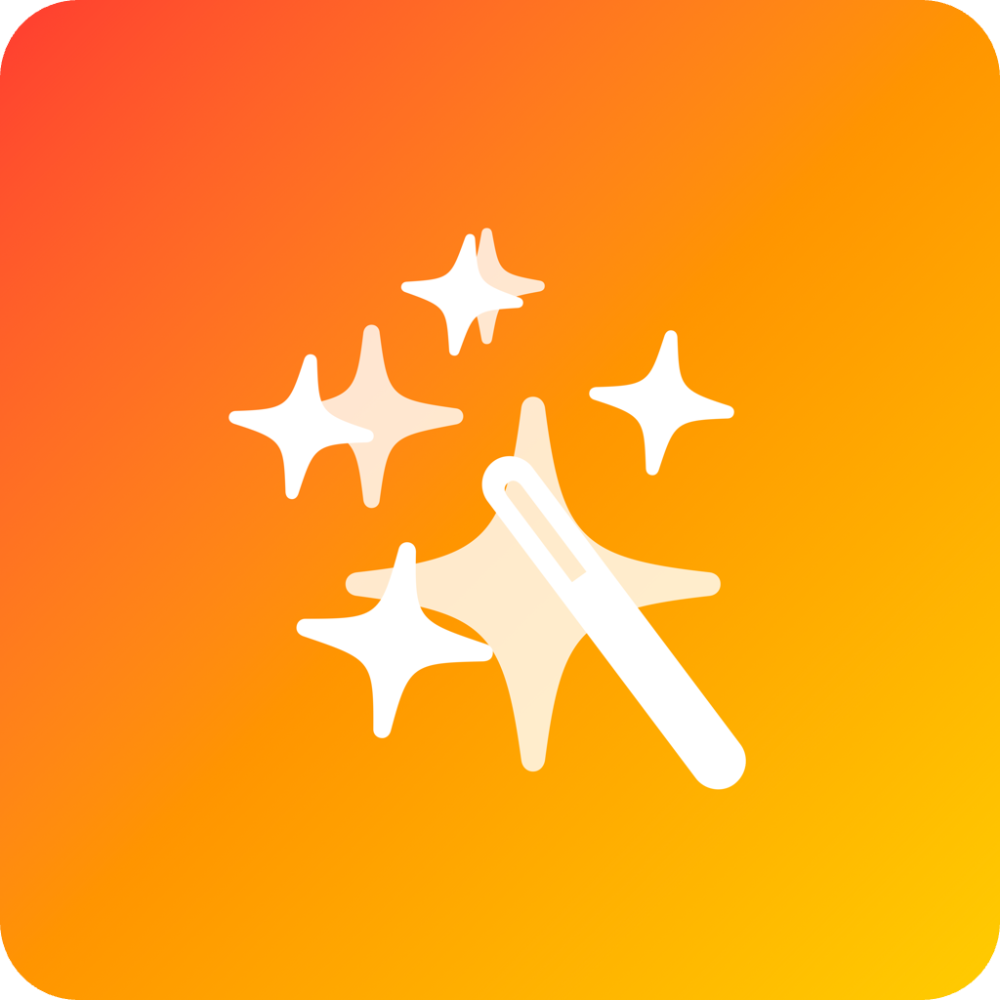

  

<h1 align="center">AiLinks — 畅所欲言，连接任何AI，前所未有的快捷体验</h1>

  
  
  
  

  <a href="README.md">English</a> | <b>中文</b> | <a href="README.ja.md">日本語</a>

AiLinks 让冗长的提示变成快捷的语音便签：**轻点 → 说话 → 完成**。  
无需切换应用，即可在 GPT-4o、Claude-sonnet-3.7、Gemini 2.5 Pro、DeepSeek V2 等世界上最先进的多种模型间一键切换，体验极致流畅。

  

## ✨ 主要功能

| | |
| --- | --- |
| 🔊 **一键语音输入** | 按住麦克风，说话，松开即发送——比打字快 30%。 |
| ⚡ **多模型无缝切换** | 一键切换 GPT-4o、Gemini、Claude、DeepSeek 等主流模型。 |
| 🗂 **空间管理** | 侧边栏式工作区，轻松分隔工作、学习与生活对话。 |
| 📲 **本地 Whisper 识别** | 短语音本地转写保护隐私，长语音自动云端转写省电省心。 |
| ☁️ **iCloud 同步** | 对话与空间实时同步，iPhone 与 iPad 无缝衔接。 |
| 🌐 **内容预览** | 聊天内实时渲染 HTML、Markdown、代码块。 |
| 🗒 **Markdown 导出** | 一键复制或分享至文件、iCloud 云盘、Obsidian。 |
| ⭐ **原生 SwiftUI** | 100% SwiftUI，VisionOS 适配，体积仅 5 MB，无 Electron 臃肿。 |

## 🗺 产品规划

- 🎨 **AI 绘图**：支持 GPT-4o 语音/文本生成图片  
- 🚀 **快捷指令集成**：通过 Siri 自动化各类流程  
- 🌐 **原生 Mac 版**：完整 SwiftUI 桌面体验  
- 🖼 **MCP 图片上传**：支持多模态推理与图片对话  

## 🐣 早鸟特惠

| | |
| --- | --- |
| 💰 **免费下载**+3天试用 | 早鸟年费仅 ¥29.9（Mac 版上线后涨至 ¥49.9） |
| 🎨 专属皮肤 | 限定感谢主题包 |
| 🎟 终身代币折扣 | 未来应用内代币包永久折扣 |
| 🛠 每周开发日志 | 每周五推送进度更新 |

## 📦 安装方式

  
  &nbsp;&nbsp;&nbsp;&nbsp;
  

- **App Store** → <https://apps.apple.com/app/ailinks/id6743006772>  
- **TestFlight（公测版）** → <https://testflight.apple.com/join/XXXXXXXX>

## 📚 使用文档

- [用户指南](https://docs.ailinks.app)  
- [API 密钥设置](https://docs.ailinks.app/providers)  
- [常见问题](https://docs.ailinks.app/faq)  
- [完整文档](https://docs.ailinks.app/)

## 🌎 社区

| | |
| --- | --- |
| 💬 **Discord** | [问题社区反馈](https://discord.gg/arnvHF4hdX) |
| 🐦 **X / Twitter** | [@Wishworldbetter](https://x.com/kissWish9) |
| 📰 **Indie Hackers 日志** | 公开构建进展 |

## 📄 版权声明

**专有软件 — 保留所有权利**  
版权所有 © 2025 AiLinks 团队。  
未经授权，禁止复制、分发或逆向工程本软件。最终用户条款详见 [Terms of Service](https://docs.ailinks.app/terms)。

> Made with ☕️ & 🧡 in Los Angeles  
> *“点击，说话，让 AI 处理剩下的事情。”* — Wishworldbetter
