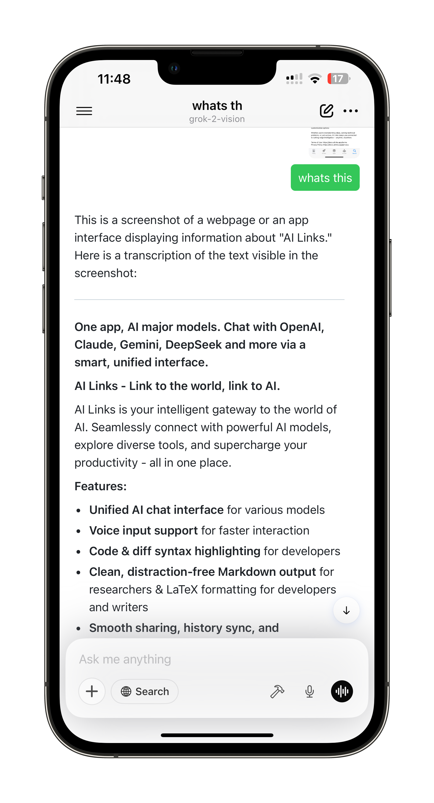

# AiLinks 🚀  

  

  
  
  
  

**iPhone和iPad上最流畅的、以语音为主的AI交互工作空间。**

AiLinks将冗长的提示转化为快速语音笔记：**点击 → 说话 → 完成**。  
在GPT-4o、Claude 3 Sonnet、Gemini 2.5 Pro、DeepSeek V2（以及更多）之间无缝切换，全部在一个超级流畅的应用中完成。

  

## ✨ 功能特点

| | |
| --- | --- |
| 🔊 **点击说话** | 按住麦克风，说话，松开——比打字快30%。 |
| ⚡ **模型无关性** | 一键切换GPT-4o、Gemini、Claude、DeepSeek等。 |
| 🗂 **空间管理** | 侧边栏式工作区使工作/学习/生活聊天整洁有序。 |
| 📲 **设备端Whisper** | 短提示在本地转录以保护隐私；长提示则回退到云端以节省电池。 |
| ☁️ **iCloud同步** | 对话和空间在iPhone和iPad之间实时更新。 |
| 🌐 **成果预览** | 在聊天内直接实时渲染HTML/Markdown/代码块。 |
| 🗒 **Markdown导出** | 一键复制或分享到文件/iCloud云盘/Obsidian。 |
| ⭐ **原生SwiftUI** | 100% SwiftUI，VisionOS就绪，**仅5 MB**——没有Electron的臃肿！ |

## 🗺 路线图

- 🎨 **图像生成**，使用GPT-4o（语音或文字提示）  
- 🚀 **快捷指令集成**——通过Siri自动化工作流  
- 🌐 **原生Mac应用**——完整的SwiftUI桌面体验  
- 🖼 **MCP上传**——发送图像进行多模态推理  

## 🐣 早鸟特惠

| | |
| --- | --- |
| 💰 **免费下载**和3天试用 | 早期支持者**每年29.9美元**（Mac版发布后价格将上涨至49.9美元） |
| 🎨 专属皮肤 | 感谢主题包 |
| 🎟 终身代币折扣 | 未来应用内代币包永久折扣 |
| 🛠 每周开发日志 | 每周五收到进度更新 |

## 📦 安装

> **AiLinks是专有软件。源代码不公开分发。**  
> 仅可从以下渠道获取应用：

- **App Store** → <https://apps.apple.com/app/ailinks/id6743006772\>  
- **TestFlight（公测版）** → <https://testflight.apple.com/join/XXXXXXXX\>

## 📚 文档

- [用户指南](https://docs.ailinks.app)  
- [API密钥设置](https://docs.ailinks.app/providers)  
- [常见问题](https://docs.ailinks.app/faq)  
- [完整文档](https://docs.ailinks.app/)

## 🌎 社区

| | |
| --- | --- |
| 💬 **Discord** | 加入讨论并为功能投票 |
| 🐦 **X / Twitter** | [@Wishworldbetter](https://x.com/kissWish9) |
| 📰 **Indie Hackers日志** | 公开构建更新 |

## 📄 许可证

**专有软件——保留所有权利**  
版权所有 © 2025 AiLinks团队。  
未经授权复制、分发或反向工程本软件是被禁止的。查看[`EULA.md`](EULA.md)了解最终用户条款。

> 在洛杉矶用☕️和🧡制作  
> *"点击，说话，让AI处理剩下的事情。"* — Wishworldbetter
